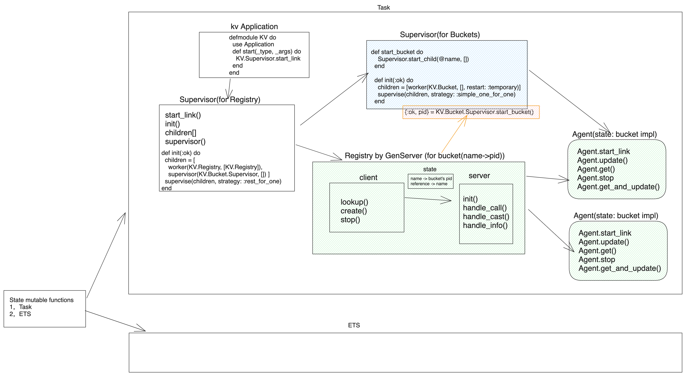

# KV

**关于 OTP behaviors 的一个 kv 示例**

Architecture:



## Modules

-   KV.Bucket 模块： 负责存储可被不同进程读写的键值对

## State

-   Agent: 对状态简单的封装
-   GenServer: 通用的服务器进程，它封装了状态，提供了同步或者异步调用，支持代码热更新等等。
-   GenEvent: 通用的事件管理器，允许向多个接收者发布消息
-   Task: 计算处理异步单元，可以派生出进程并稍后收集计算结果

### Agent

```elixir
{:ok, agent} = Agent.start_link fn -> [] end # {:ok, #PID<0.57.0>}
Agent.update(agent, fn list -> ["eggs"|list] end) # :ok
Agent.get(agent, fn list -> list end) # ["egges"]
Agent.stop(agent)
```

由于 agent 是进程，每个 bucket 只有一个进程 id（pid）而不是名字。 在《入门手册》中进程那章中提到过，我们可以给进程注册名字。 我们可以使用这个方法来给 bucket 起名：

```elixir
Agent.start_link(fn -> %{} end, name: shopping)
KV.Bucket.put(:shopping, "milk", 1)
KV.Bucket.get(:shopping, "milk)
```

### GenServer

创建通用的服务器的首选抽象物

一个 GenServer 实现分为两个部分：客户端 API 和服务端回调函数。 这两部分可以写在同一个模块里，也可以分开写到两个模块中。 客户端和服务端运行于不同进程，依靠调用客户端函数来与服务端来回传递消息。 方便起见，这里我们将这两部分写在一个模块中。

### Supervisor

监督者

```elixir
KV.Supervisor.start_link
KV.Registry.create(KV.Registry, "shopping")
KV.Registry.lookup(KV.Registry, "shopping")
```

### Application

在 mix.exs 里面添加：

```elixir
def application do
  [applications: [:logger],
   mod: {KV, []}]
end
```

`lib/kv.ex` 里面添加 `Application`需要用到的 `start()`:

```elixir
defmodule KV do
  use Application

  def start(_type, _args) do
    KV.Supervisor.start_link
  end
end
```
